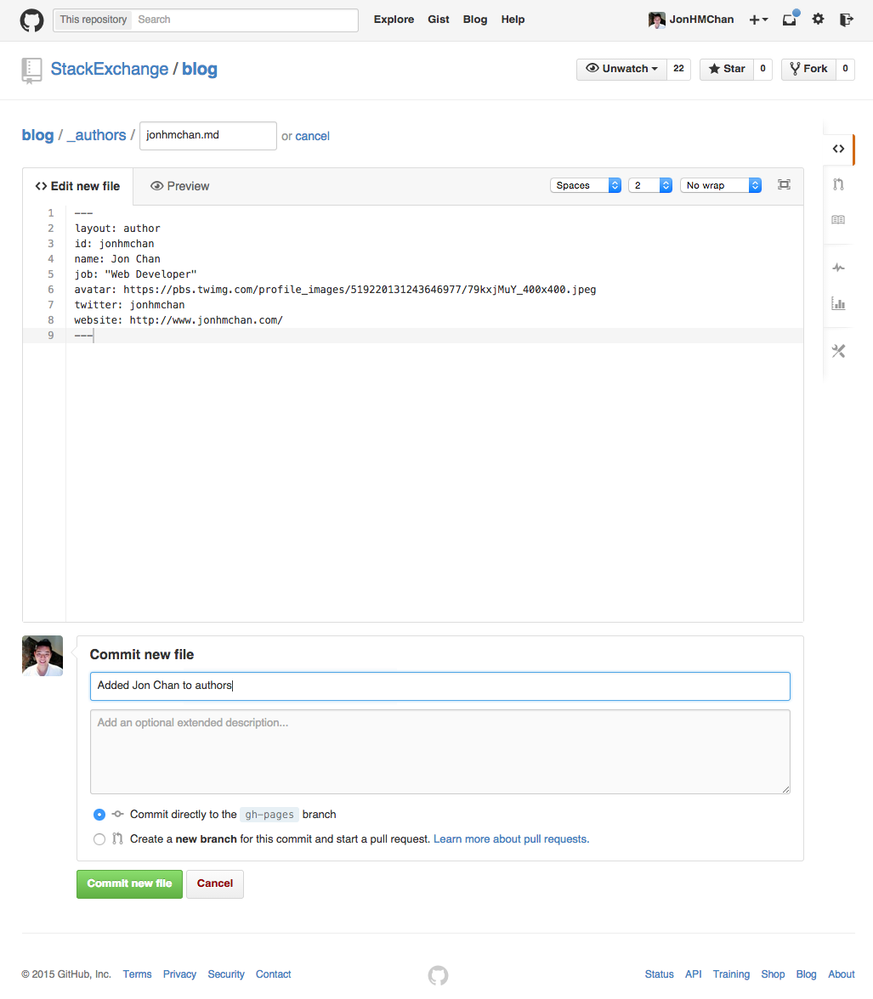

# [Stack Overflow Blog](http://blog.stackoverflow.com/)

## Getting Started
This blog runs on [Jekyll](http://jekyllrb.com/). Posts are written in [markdown](https://github.com/adam-p/markdown-here/wiki/Markdown-Cheatsheet).

If you are actively involved in improving the infrastructure of this project, you should read the documentation for these tools thoroughly (they're pretty short as it is). If you are simply contributing, this guide should be enough to get you going.

## Quick Links
 - [Add yourself as a contributor on the blog](https://github.com/StackExchange/blog/new/master/_people) ([See an example file](https://github.com/StackExchange/blog/edit/master/_people/jonhmchan.md))
 - [Publish a new post](https://github.com/StackExchange/blog/new/master/_posts) ([See an example file](https://github.com/StackExchange/blog/edit/master/_posts/2014-01-28-My-First-Six-Weeks-Working-At-Stack-Overflow.md), [published version](http://stackexchange.github.io/blog/01/28/My-First-Six-Weeks-Working-At-Stack-Overflow/))
 - [Dev blog (where to preview posts before going live; mainly for employees, but not secret)](http://dev.blog.stackexchange.com/)
 - [Internal image uploader (for employees only, must be on VPN or on office network)](http://blogtools.ds.stackexchange.com/)
 - [Company editorial board and calendar (for employees only, post ideas and see schedule)](https://trello.com/b/WYAPaUEC/blog-editorial-and-calendar)

## What is this blog for?
This is the official company blog for Stack Overflow. Everything related to new features, announcements, engineering projects, and all things Stack Overflow live on this blog. The contributors on this blog are Stack Overflow employees, but in the future, we may open this up to outside contributors as well.

**This GitHub repository is public**, so anyone can immediately see updates, new post drafts, and similar changes, even before they are deployed to the blog. Given our *default public* company policy, you shouldn't usually worry about this. However, in the rare case that you're writing a post that is time-sensitive and contains information that must not be leaked before being officially published on the blog, you should not add that post to this repository in advance.

### I have an idea for / want to write a post, what should I do?
1. Go to our [Blog Editorial and Calendar Trello board](https://trello.com/b/WYAPaUEC/blog-editorial-and-calendar) and add any and all of your ideas to the `Ideas/Backlog` column.
2. In the card, you need to do the following (see [example here](https://trello.com/c/CtdGiI8C/5-how-we-built-our-brand-new-blog)):
 - Add yourself as a member and anyone else you think might be helpful in writing the post
 - Designate a single **author** in the description that is going to be responsible for writing the post
 - You should also put a **description** of what the post is going to be about
 - Add any relevant **tags** like `announcement`, `diversity`, or `engineering` onto the card
3. As cards get added, Rachel Maleady and Jon Chan will go through all the cards in the `Ideas/Backlog` column, and move anything we want to discuss into the `Being Scheduled This Week` column. Sometimes things that *have* to get scheduled (like the regular podcast posts) will get added directly into this column. If your card got moved into the `Being Scheduled This Week` column, feel free to join Rachel and Jon in the meeting to chat about your ideas.
4. Every week during the editorial meeting, Rachel and Jon will move cards from `Being Scheduled This Week` into a `Publishing This Month` or `Publishing Next Month` column. Once that's done, you should start [writing your post](https://github.com/StackExchange/blog#2-publishing-a-post) and we're going to occasionally heckle you about it until it's published :) If you have trouble figuring out how to do this, feel free to ask Jon or Rachel.
5. As you write your post, feel free to commit it (unless it contains information that should remain confidential for the time being). Jon and Rachel will constantly be looking at what gets added here and nothing will get published publicly until we manually hit the production build, so don't worry too much about making mistakes and stuff. As you write and make commits, it automatically builds on an internal dev tier at http://dev.blog.stackexchange.com/, so if you want to see what it looks like before you publish, you can see it there.
6. Once the deadline arrives, we'll check with you to make sure it's exactly as you like it, then we'll push to production!

## Quickstart

###1. Add yourself as a contributor with an people file

[Add yourself as a contributor on the blog](https://github.com/StackExchange/blog/new/master/_people) ([See example file](https://github.com/StackExchange/blog/edit/master/_people/jonhmchan.md))

You need to create a new markdown file with your username in the `_people` folder to be included as a contributor on the blog. For example, Jon Chan uses the username `jonhmchan` so he would create a new file named `jonhmchan.md`. In the content of this markdown file should be the following (you don't need the square brackets):
```
---
layout: author
id: [username, must be same as file name]
name: [your full name]
job: [job title]
avatar: [url to an image to be used with all your posts. Most people use their Gravatar pic url]
twitter: [your twitter handle, without the @]
github: [optional, your github user name]
stack: [optional, url to your stack overflow/exchange profile]
youtube: [optional, url to youtube video or playlist]
website: [optional, url to your personal site]
---
```
So Jon Chan's `jonhmchan.md` file would look like:
```
---
layout: author
id: jonhmchan
name: Jon Chan
job: Developer, Head of Evangelism
avatar: https://www.gravatar.com/avatar/0090f1f22a03e38ca61dc955e1d0a346?s=100
twitter: jonhmchan
github: jonhmchan
stack: http://stackoverflow.com/users/1043674/jon-chan
website: http://www.jonhmchan.com/
---
```
**How to add this file**

If you are a developer, you can do this simply by submitting a PR or adding this file to the `_people` directory. If you are not a developer, you can use [this link on GitHub](https://github.com/StackExchange/blog/new/master/_people) to create this file, then submit your changes by adding a commit message like `Added [your name] to authors` and hitting the `Commit new file` button:



Once you do commit this file, you may be asked to create a pull request. Click `Create Pull Request` to do so:


Then on the next screen, you can submit the pull request:


###2. Publishing a post

[Publish a new post](https://github.com/StackExchange/blog/new/master/_posts) ([See example post file](https://github.com/StackExchange/blog/edit/master/_posts/2014-1-28-My-First-Six-Weeks-Working-At-Stack-Overflow.md), [published version](http://stackexchange.github.io/blog/01/28/My-First-Six-Weeks-Working-At-Stack-Overflow/))

To create a new post, you need to create a new markdown file with a particular format in the `_posts` folder in order to publish. The file needs to include the date and title separated by dashes: `YYYY-MM-DD-Title-With-Dashes-As-Spaces.md`. For example, Jon Chan published a post on January 28th, 2014 titled "My First Six Weeks Working at Stack Overflow". So the title of his file was `2014-1-28-My-First-Six-Weeks-At-Stack-Overflow.md`.  In the content of this markdown file should be the following (you don't need the square brackets): 
```
---
layout: post
title: [title of your post]
author: [your author id]
date: [the date you want this to be published in YYYY-MM-DD HH:MM:SS format. If in the future, will be put in draft mode and will publish at that time. Optional, you can remove this whole line]
draft: [true or false, will hide the post from any display lists. If not a draft, you can also remove this whole line]
hero: [url of a high quality hero image to be used for your post. Optional, you can remove this whole line]
source: [url of the original post so a source banner will be added to the post. Optional, you can remove this whole line]
description: [a description that will show up in search results, up to 160 characters. Optional, you can remove this whole line]
tags: [what channel this post belongs to (engineering/company), and any related tags, required]
langs: [what languages this post will be available in, optional. You should add the country code in lowercase like 'jp', 'es', 'ru'. If this includes 'en' it will show up in the feeds]
---
[Content of your post in markdown]
```
So Jon Chan's post `2014-1-28-My-First-Six-Weeks-At-Stack-Overflow.md` would look something like the following:
```
---
layout: post
title: My First Six Weeks Working at Stack Overflow
date: 2014-01-28
author: jonhmchan
hero: https://ununsplash.imgix.net/photo-1416339306562-f3d12fefd36f?q=75&fm=jpg&s=dd8bffcffb3d622bea05c74d203121c6https://unsplash.imgix.net/photo-1416339442236-8ceb164046f8?q=75&fm=jpg&s=8eb83df8a744544977722717b1ea4d09
source: http://www.jonhmchan.com/blog/2014/1/16/my-first-six-weeks-working-at-stack-overflow
tags:
 - engineering
 - onboarding
---

I started working at [Stack Overflow](http://stackoverflow.com/) as a software developer just six weeks ago. This (lengthy) post is about a number of things: what it was like relearning a lot of what I know about web development, the challenges and resources I encountered doing so, and a few pointers others might benefit from on-boarding on a new development team.

...
```
You can see what [this post](http://stackexchange.github.io/blog/01/28My-First-Six-Weeks-Working-At-Stack-Overflow/) looks like as a full markdown file by going to [this link](https://github.com/StackExchange/blog/edit/master/_posts/2014-1-28-My-First-Six-Weeks-Working-At-Stack-Overflow.md).

**How to add this file**

Adding this file is very similar to adding your original authors markdown file. You can use git to add your post markdown file in the `_posts` folder, or you can use the [GitHub user interface](https://github.com/StackExchange/blog/new/master/_posts) to do so. Note that the moment you commit this file, it will be published to the blog.

**Writing your post with Markdown**

Everything following the second set of three dashes in your post markdown file will be the content of your post. We use [markdown](https://github.com/adam-p/markdown-here/wiki/Markdown-Cheatsheet) to format the post.

**Uploading Images**

Adding images to your post requires you to upload the image and use the URL in your markdown. We have an internal image uploader tool that you can access at the following link: http://blogtools.ds.stackexchange.com/ . You will need to be connected to the VPN or wired to the internal office network.

In addition to the different methods, there are some basic guidelines to what is allowed:

 - Your images should *never* be bigger than 50KB
 - Maximum width of any image should be 800 pixels
 - Do your best to avoid images with text in them, it makes it difficult to use as a background

 Note that using our internal tool will host the images in the right place and also deal with resizing/compressing.

**Drafts**

You can always set your posts as drafts. You can do this by adding the line `draft: true` into the metadata of your post. Putting your post into draft mode means it won't show up anywhere that blog posts are listed, but you can still see the post at its individual URL, and it will still be visible on [dev.blog](http://dev.blog.stackexchange.com/) and on GitHub.

**Adding tags**

Every post is required to have at least one tag: either `company` or `engineering` depending on which channel it belongs on (it can also have both). You can then add any additional tags afterwards.

*Note:* the post tags control how the post will appear in the community bulletin on the sidebar of the Q&A sites. Posts tagged `company` will be displayed on *all* sites in the network. To display a post only on Stack Overflow and Meta Stack Overflow, use the `stackoverflow` tag (without `company`). Be a bit careful with `company`, since we don't want to inundate our 150+ communities with posts that only apply to, say, Stack Overflow. If in doubt, check with someone on the Community team.

When writing a new post, you can add listed tags at the top of the post markdown file. 
```
---
layout: post
title: [title of post]
author: [author id]
tags:
- [tag1]
- [tag2]
- [tag3]
---

```

**Internationalization**

By default, all posts are assumed to be in English and targeted for English-speaking audiences. However, there is a way to make sure that posts are flagged as internationalized using the optional `langs` parameter in a post. Flagging a post that is internationalized and does *not* support English will do the following:
 - Posts will *not* show up in any of the list pages on the blog. This includes the homepage, and the two channel pages for Company News and Engineering navigable from the top menu.
 - Posts will *not* appear in the RSS feed at `/feed`. That means posts will *not* be syndicated on the community bulletin or in RSS feeds.
 - Posts will be accessible only from the direct URL.
 - Posts will continue to show up for the author list pages.

When writing a new post, you can add the language audiences this post is for at the top of the post markdown file with the optional parameter. 
```
---
layout: post
title: [title of post]
author: [author id]
langs:
- [lang1]
- [lang2]
- [lang3]
---
```

For example, if you wanted to make sure that this post was flagged for Japanese, you would add the country code `jp`:
```
---
layout: post
title: [title of post]
author: [author id]
langs:
- jp
---
```

However, if you add `en` to the list of languages, it will *also* be syndicated like a default post:
```
---
layout: post
title: [title of post]
author: [author id]
langs:
- jp
- en
---
```

If you leave out the `langs` parameter, leave it empty, or add `en` to the list of languages supported, the post will behave with the default behavior and be treated like a regular post.

**Where to get good hero images**
 - [Unsplash](https://unsplash.com/grid)
 - You can also upload them to `images` and it will be accessible using `/images/path-to-your-image`
 - Search our internal drive for "Photos" there are a number of professional photos we have in store

**Code snippets**

Jekyll has support for code snippets and highlighting built-in using [Pygments](http://pygments.org/). To include a codeblock with in your markdown, use the following syntax:
```

[Your code here]

```
So if you were going to be including a snippet of Ruby code in your post, it would look like:
```

def show
  @widget = Widget(params[:id])
  respond_to do |format|
    format.html # show.html.erb
    format.json { render json: @widget }
  end
end

```

**YouTube videos**

To embed a YouTube video directly in a post, use the `youtube.html` include like this:

```

```

You can get a video's id by looking at the URL of the video's page on YouTube ([youtube.com/watch?v=SQoA_wjmE9w](https://www.youtube.com/watch?v=SQoA_wjmE9w) in this example).

## Making code changes

If you are interested in making changes to the design, functionality, or structure of the blog, you're going to need to set up a local environment and understand some of the technologies behind the site.

**1. Install Jekyll and dependencies.** First thing you're going to need to do is set up Jekyll and the appropriate dependencies so you can develop locally. To do this, just make sure you have Ruby and Bundler installed then run:
```
bundle install
```

**2. Run a local version of the blog.** Using Git, clone the latest version of this repository to your local machine using the following command:
```
git clone https://github.com/StackExchange/stack-blog.git
```
Then go into root of the folder and run `jekyll serve`:
```
cd stack-blog
jekyll serve
```
This will get a local version of the blog running on your machine, accessible on `localhost:4000/blog/`

**3. Read up on the documentation.** To really understand how to develop the site there are a few things you're going to need to read up on to make meaningful changes:
 - [Jekyll](http://jekyllrb.com/docs/home/) The static site generator used for the site
 - [GitHub Pages](https://help.github.com/articles/using-jekyll-with-pages/) How the site is hosted
 - [Liquid](https://docs.shopify.com/themes/liquid-documentation/basics) The templating language used with Jekyll by Shopify
 - [Stack Overflow Careers Pattern Library](http://stackexchange.github.io/uikit/index.html) Our pattern library by our designers that includes a full LESS framework for rapid development
